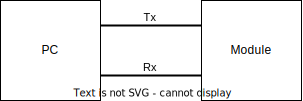
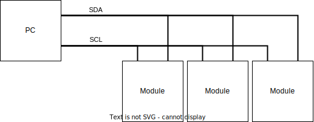
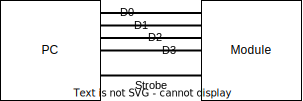
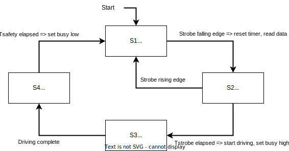

# What is TTL?

TTL means "Transistor-Transistor Logic." "TTL control" refers to a control
method for optical modules that uses static digital voltage signals as inputs.

To get a better sense of what TTL is, remember that the other two main control
protocols we use are RS-232 and I2C. RS-232 is also referred to as "UART"
(Universal Asynchronous Receive and Transmit) or "Serial."

-   **RS-232** consists of one transmit ("Tx") wire and one receive ("Rx") wire
    between two processors (usually the module and a PC). The PC's Rx line is
    the module's Tx line, and the module's Rx line is the PC's Tx line. The two
    have agreed on a certain baud rate (usually 115200), which is measured in
    bits per second. Each processor can send data on their Tx line at the
    specified baud rate while also receiving data on their Rx line which they
    interpret at the specified baud rate.
-   **I2C** consists of two wires that are shared between one controller and one
    or more peripherals. There is one wire (the SDA wire) that is used for
    transmitting data in both directions and another wire (the SCL wire) for
    carrying a clock signal. When the controller sends data on SDA, it also has
    to pulse the SCL line for every bit sent. Likewise, the peripherals will
    only read from SDA when they see pulses on SCL. Each peripheral has its own
    assigned address. When the controller sends out a command, it starts by
    including the address of the peripheral that it wants to communicate with.
    Peripherals may listen to the data and respond over SDA if they are assigned
    to the specified address. In this way, all the peripherals share the same
    2-wire interface.

Now that we have reviewed how RS-232 and I2C work, let's talk about TTL. With
the previously described communication protocols, we had designated single wires
for sending data, and _time_ played a huge role in determining what bytes got
sent. In order to send one byte over a single wire, we had to either use
specified time interval for each bit and send the byte out over 8 occurrences of
that time interval or use a clock to pulse out 8 pulses on a separate wire.

With TTL, instead of separating bits by _time_, we separate them by _space_.
What this means is that we have a separate wire for each bit and the states of
those wires determine the data. There is an additional "strobe" line that acts
like a clock — the data on all the lines gets read when the strobe signal is
pulsed.

The diagrams below show what the wires look like for these three protocols.

#### RS-232



#### I2C



#### TTL



There is a fundamental difference between how these protocols operate. With
RS-232 and I2C, we can send out any string of bytes over a data line. With TTL,
we can choose the state of N bits, and then "apply" that state by pulsing the
strobe.

# TTL Specifics

TTL is also usually associated with a "busy" signal which is an output from the
module. After the strobe signal is pulsed, the module will read the data lines
and take some action using the data. While it is taking that action, it will set
its busy output to high in order to tell the controller that it is not ready to
receive another strobe pulse. After the module is done with its action, it will
set the busy signal back to low, indicating to the controller that it is ready
for another strobe.

Below is a timing diagram for how the TTL signals must behave. Important moments
are marked with letters, which are described below.

```none
                    a   b   c            d            e
                    v   v   v            v            v
        ________________                  ________________
Strobe                  |________________|
        _   _   __________________________________________
D0       |_| |_|
        ______
D1            |___________________________________________
          ___   __________________________________________
D2      _|   |_|
                                          ____________
Busy    _________________________________|            |___
                    ^   ^   ^            ^            ^
                    a   b   c            d            e
```

-   `Strobe` is active low, meaning that the default state is high. A pulse is
    measured starting with a falling edge and ending with a rising edge.
-   Time `b` is the falling edge of `strobe`. This represents the beginning of
    the pulse and is the data capture moment. Whatever state the data lines are
    in at this time is the state that the module will see.
-   The time between `a` and `b` is called the setup time. This is usually
    100μs. The data lines can be changing before time `a`, but they must be
    stable at least 100μs before `b`.
-   The time between `b` and `c` is called the hold time. This is usually 100μs.
    The data lines can be changing after time `c`, but they must be stable for
    at least 100μs after `b`.
-   The time from `b` to `d` is the strobe pulse width. This is usually 1ms. If
    the strobe pulses for less than this time, then the whole pulse is ignored.
    This prevents jitter on the strobe line from triggering a state change in
    the module.
-   Time `d` is the state change time. This is the rising edge of `strobe` after
    it has been low for at least the required strobe pulse width time. This is
    when the module will actually take action on the new state data and set the
    busy signal high.
-   From time `d` to time `e` is the busy time. This is usually 10ms, but it can
    vary. After the busy time has elapsed, the module sets the busy signal back
    to low.

In summary, a valid TTL pulse follows these steps:

1. `Strobe` is high, `busy` is low, and the data lines can change.
1. The data lines stop changing.
1. 100μs or more later, `strobe` goes low.
1. 100μs or more later, the data lines can change again (not necessary).
1. 1ms or more after `strobe` went low, `strobe` goes high and `busy` goes high.
1. 10ms later, `busy` goes low.

If the data lines are changing within that 200μs window around the falling edge
of `strobe`, it just means that there is no guarantee that the data will be
captured correctly.

If `strobe` falls low while `busy` is still high (likely because the controller
tried to send another pulse before the module was ready), then that strobe pulse
will be ignored and the system will not be ready until `strobe` has gone high
again to get back to its initial state.

# How to Implement TTL

### State Machine

This state machine diagram describes the TTL protocol.



Starting from S1, a `strobe` falling edge takes us to S2. On this transition, we
reset the timer and capture the data from the GPIO data lines. From S2, one of
two things can happen: either `strobe` goes high and we return to the beginning,
or 1ms passes with strobe staying stable and low and we advance to S3. Once in
S3, we are just waiting for `strobe` to go high again; When it does, we advance
to S4. Finally after being in S4 for 10ms, we transition back to S1 and start
over.

### Code

We can implement TTL in the STM32 firmware context using GPIO interrupts and
timers.

Let's define the states like this:

```c
enum StrobeState
{
    WAITING_FOR_FALLING_EDGE = 0, // S1
    WAITING_FOR_TIMER = 1,        // S2
    WAITING_FOR_RISING_EDGE = 2,  // S3
    WAIT_10_MS = 3,               // S4
};

// current state machine state
StrobeState state = WAITING_FOR_FALLING_EDGE;

// captured data from the data pins
uint8_t ttlState = 0;

// mechanism for counting up to 10ms
uint8_t timerCount = 0;
```

First, set up a 1ms timer. This timer will be used to count both the 1ms strobe
pulse time and the 10ms busy time.

Then, set up interrupts for the `strobe` signal on both the rising and falling
edges.

#### Strobe Rising Edge

Here is what needs to happen on a `strobe` rising edge:

```c
void onStrobeRisingEdge() {
    // if already in S2, the module needs to actually take its action
    if (state == WAITING_FOR_RISING_EDGE) {
        // set the busy pin high
        HAL_GPIO_WritePin(BUSY_GPIO_Port, BUSY_Pin, GPIO_PIN_SET);
        // actually set the channel
        opticalSwitch->setChannel(ttlState, false);
        // advance to S4
        state = WAIT_10_MS;
    } else if (state == WAITING_FOR_TIMER) {
        // if the strobe rose "too early" then go back to S1
        state = WAITING_FOR_FALLING_EDGE;
    }
}
```

In S2, actions need to be taken (setting the module state and raising the busy
signal). Otherwise, nothing needs doing.

#### Strobe Falling Edge

Here is the code for the falling edge of `strobe`:

```c
void onStrobeFallingEdge() {
    // if already in S0, then reset the timer and capture the data pins
    if (state == WAITING_FOR_FALLING_EDGE) {
        // reset HAL timer
        getHandle()->Instance->CNT = 0;
        // advance to S2
        state = WAITING_FOR_TIMER;
        // capture the data
        uint8_t d0 = HAL_GPIO_ReadPin(D0_GPIO_Port, D0_Pin);
        uint8_t d1 = HAL_GPIO_ReadPin(D1_GPIO_Port, D1_Pin);
        uint8_t d2 = HAL_GPIO_ReadPin(D2_GPIO_Port, D2_Pin);
        ttlState = ((d2 << 2) | (d1 << 1) | (d0 << 0)) & 0x07;
    }
}
```

From S0, a falling edge means we need to reset the 1ms timer to 0 counts (so
that the next time it fires will be 1ms from now) and capture the state of the
data pins.

#### Timer Interrupt

Finally, here is the code for the timer interrupt. This code is executed each
time the 1ms timer's count elapses.

```c
void timerAction() {
    // from S2, 1 timer action means 1ms passed, which means we advance to S3
    if (state == WAITING_FOR_TIMER) {
        state = WAITING_FOR_RISING_EDGE;
    }

    // from S4, this function must get called 10 times to advance back to S1
    if (state == WAIT_10_MS) {
        // if it has been 10ms, reset the timer count, lower the busy signal, and go to S1
        if (timerCount > 9) {
            // go back to S1
            state = WAITING_FOR_FALLING_EDGE;
            // reset the timer count
            timerCount = 0;
            // set the busy pin low
            HAL_GPIO_WritePin(BUSY_GPIO_Port, BUSY_Pin, GPIO_PIN_RESET);
        } else {
            // if it hasn't been 10ms yet, just increment the timer count
            timerCount++;
        }
    }
}
```

As the timer is ticking, each call will increment `timerCount` until it
reaches 10. At that point, the next timer interrupt will trigger the module to
reset itself back to the initial state where it will be ready to receive another
`strobe` falling edge interrupt.

### Summary

It should be fairly clear how the explanation of TTL maps onto the state machine
diagram and how the 3 functions above implement the state machine correctly.

# Why TTL?

"Because the customer wants it" is usually a good enough reason, but why would
they want it? TTL is simple and easy to use. You don't have to worry about
complicated things like baud rates or shared data lines, etc.

TTL is also very fast at getting the information to the target. You just set up
some input voltages and _BAM_, you're there.

TTL is a "one-way" communication. There is no possible way for the module to
respond with any information back to the PC. In situations where people are
worried about critical data accuracy and security, they get more peace of mind
knowing that they are using a 1-way protocol.

In terms of integration, TTL can also often be easier. It's much easier to build
a TTL controller in firmware than it is to build an I2C controller. I2C and UART
both require careful timing control that TTL doesn't really care about.

Finally, TTL can be compatible with some existing systems in certain cases when
UART and I2C are not.
