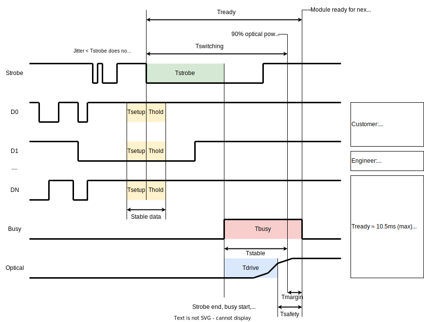

# TTL Control for Optical Modules

## What is TTL?

TTL means "Transistor-Transistor Logic." "TTL control" refers to a control
method for optical modules that uses static digital voltage signals as inputs.

To get a better sense of what TTL is, remember that the other two main control
protocols we use are RS-232 and I2C. RS-232 is also referred to as "UART"
(Universal Asynchronous Receive and Transmit) or "Serial."

-   **RS-232** consists of one transmit ("Tx") wire and one receive ("Rx") wire
    between two processors (usually the module and a PC). The PC's Rx line is
    the module's Tx line, and the module's Rx line is the PC's Tx line. The two
    have agreed on a certain baud rate (usually 115200), which is measured in
    bits per second. Each processor can send data on their Tx line at the
    specified baud rate while also receiving data on their Rx line which they
    interpret at the specified baud rate.
-   **I2C** consists of two wires that are shared between one controller and one
    or more peripherals. There is one wire (the SDA wire) that is used for
    transmitting data in both directions and another wire (the SCL wire) for
    carrying a clock signal. When the controller sends data on SDA, it also has
    to pulse the SCL line for every bit sent. Likewise, the peripherals will
    only read from SDA when they see pulses on SCL. Each peripheral has its own
    assigned address. When the controller sends out a command, it starts by
    including the address of the peripheral that it wants to communicate with.
    Peripherals may listen to the data and respond over SDA if they are assigned
    to the specified address. In this way, all the peripherals share the same
    2-wire interface.

Now that we have reviewed how RS-232 and I2C work, let's talk about TTL. With
the previously described communication protocols, we had designated single wires
for sending data, and _time_ played a huge role in determining what bytes got
sent. In order to send one byte over a single wire, we had to either use
specified time interval for each bit and send the byte out over 8 occurrences of
that time interval or use a clock to pulse out 8 pulses on a separate wire.

With TTL, instead of separating bits by _time_, we separate them by _space_.
What this means is that we have a separate wire for each bit and the states of
those wires determine the data. There is an additional "strobe" line that acts
like a clock — the data on all the lines gets read when the strobe signal is
activated.

The diagrams below show what the wires look like for these three protocols.

#### RS-232


#### I2C


#### TTL


There is a fundamental difference between how these protocols operate. With
RS-232 and I2C, we can send out any string of bytes over a data line. With TTL,
we can choose the state of N bits, and then "apply" that state by pulsing the
strobe.

## TTL Specifics

TTL is also usually associated with a "busy" signal which is an output from the
module. When the strobe signal is brought low, the module will read the data
lines. After the strobe signal is held low continuously for a specified amount
of time, the module will take some action using the data. While it is taking
that action, it will set its busy output to high in order to tell the controller
that it is not ready to receive another strobe signal. After the module is done
with its action, it will set the busy signal back to low, indicating to the
controller that it is ready for another strobe.

Below is a timing diagram for how the TTL signals must behave. Important time
sections are marked and are described below.



-   `Strobe` is active low, meaning that the default state is high. A strobe
    activation is measured starting with a falling edge and ending after
    <b>T<sub>strobe</sub></b> elapses while the strobe signal remains low.
    -   The timing of the rising edge of `strobe` after
        <b>T<sub>strobe</sub></b> is not important.
    -   <b>T<sub>strobe</sub></b> is the strobe pulse width. If the strobe is
        held low for less than this time, then the whole pulse is ignored. This
        prevents jitter on the strobe line from triggering a state change in the
        module.
-   Data is captured on each falling edge of `strobe`. Whatever state the data
    lines are in at this time is the state that the module will see.
    -   The captured data is used <b>T<sub>strobe</sub></b> after the falling
        edge.
    -   <b>T<sub>su</sub></b> is called the setup time. The data lines must be
        stable at least <b>T<sub>su</sub></b> before the falling edge of
        `strobe`.
    -   <b>T<sub>h</sub></b> is called the hold time. The data lines must be
        stable at least <b>T<sub>h</sub></b> after the falling edge of `strobe`.
-   <b>T<sub>strobe</sub></b> after the `strobe` falling edge is the state
    change time. This is when the module will actually take action on the new
    state data and set the busy signal high.
    -   While the busy signal is high, the module is not ready to receive
        another strobe activation. The busy signal will not be high for longer
        than <b>T<sub>busy</sub></b>. After the busy time has elapsed, the
        module sets the busy signal back to low.
-   <b>T<sub>drive</sub></b> is how long the module takes to drive the optical
    component to its new state.
    -   After <b>T<sub>drive</sub></b> elapses, there will be a little extra
        time before the optical output is stable. This is called
        <b>T<sub>settle</sub></b>.
    -   After <b>T<sub>drive</sub></b>, the module will wait a little bit of
        time before it can safely assume that the optical output has settled.
        This time is called <b>T<sub>safety</sub></b>, and it is based on the
        worst-case scenario for the MEMS chip type used in the component.

Typical timing values:

|                                    Time                                     |        Value         |
| :-------------------------------------------------------------------------: | :------------------: |
|                             T<sub>strobe</sub>                              |         1ms          |
|                        T<sub>su</sub>, T<sub>h</sub>                        |        100μs         |
| T<sub>busy</sub>, T<sub>drive</sub>, T<sub>settle</sub>, T<sub>safety</sub> | Depends on component |

In summary, a valid TTL input follows these steps:

1. `Strobe` is high, `busy` is low, and the data lines can change.
1. The data lines stop changing.
1. 100μs or more later, `strobe` goes low.
1. 100μs or more later, the data lines can change again (not necessary).
1. 1ms after `strobe` went low, the "command" is initiated. `Busy` goes high.
1. `strobe` goes high at some point (not necessary).
1. `Busy` goes low at some point, indicating that the operation is complete.

If the data lines are changing within that 200μs window around the falling edge
of `strobe`, it just means that there is no guarantee that the data will be
captured correctly.

If `strobe` falls low while `busy` is still high (likely because the controller
tried to send another signal before the module was ready), then that strobe
signal will be ignored and the system will not be ready until `strobe` has gone
high again to get back to its initial state.

## How to Implement TTL

### State Machine

This state machine diagram describes the TTL protocol.


Starting from S1, a `strobe` falling edge takes us to S2. On this transition, we
reset the timer and capture the data from the GPIO data lines. From S2, one of
two things can happen: either `strobe` goes high and we return to the beginning,
or <b>T<sub>strobe</sub></b> elapses with `strobe` staying stable and low and we
advance to S3. On this transition, we start driving the component and set the
busy signal to high. Once in S3, we are just waiting for the driving to be done;
When it is, we advance to S4. Finally after being in S4 for
<b>T<sub>safety</sub></b>, we transition back to S1 and start over.

### Code

We can implement TTL in the STM32 firmware context using GPIO interrupts and
timers.

Let's define the states like this:

```c
enum StrobeState
{
    WAIT_FOR_FALLING_EDGE = 0, // S1
    WAIT_FOR_STROBE = 1,       // S2
    DRIVING = 2,               // S3
    WAIT_FOR_SAFETY = 3,       // S4
};

// timing constant
#define T_SAFETY 6

// current state machine state
StrobeState state = WAIT_FOR_FALLING_EDGE;

// captured data from the data pins
uint8_t ttlState = 0;

// mechanism for counting up to 10ms
uint8_t timerCount = 0;
```

First, set up a 1ms timer. This timer will be used to count both the 1ms strobe
pulse time and the 6ms busy time.

Then, set up interrupts for the `strobe` signal on both the rising and falling
edges.

#### Strobe Rising Edge

Here is what needs to happen on a `strobe` rising edge:

```c
void onStrobeRisingEdge() {
    // if in S2, go back to S1
    if (state == WAIT_FOR_STROBE) {
        state = WAIT_FOR_FALLING_EDGE;
    }
}
```

In S2, a rising `strobe` means there was jitter on the strobe line and we need
to just go back to the initial state. In any other state, we don't care about
the rising `strobe`.

#### Strobe Falling Edge

Here is the code for the falling edge of `strobe`:

```c
void onStrobeFallingEdge() {
    // if already in S0, then reset the timer and capture the data pins
    if (state == WAITING_FOR_FALLING_EDGE) {
        // reset HAL timer
        getHandle()->Instance->CNT = 0;
        // advance to S2
        state = WAIT_FOR_STROBE;
        // capture the data
        uint8_t d0 = HAL_GPIO_ReadPin(D0_GPIO_Port, D0_Pin);
        uint8_t d1 = HAL_GPIO_ReadPin(D1_GPIO_Port, D1_Pin);
        uint8_t d2 = HAL_GPIO_ReadPin(D2_GPIO_Port, D2_Pin);
        ttlState = ((d2 << 2) | (d1 << 1) | (d0 << 0)) & 0x07;
    }
}
```

From S0, a falling edge means we need to reset the <b>T<sub>strobe</sub></b>
timer to 0 counts (so that the next time it fires will be 1ms from now) and
capture the state of the data pins. In any other state, we don't care about a
`strobe` falling edge.

#### Timer Interrupt

Finally, here is the code for the timer interrupt. This code is executed each
time the 1ms timer's count elapses.

```c
void timerAction() {
    // from S2, 1 timer action means 1ms passed, which means we advance to S3
    if (state == WAIT_FOR_STROBE) {
        // set the busy pin high
        HAL_GPIO_WritePin(BUSY_GPIO_Port, BUSY_Pin, GPIO_PIN_SET);
        // actually set the channel
        opticalSwitch->setChannel(ttlState, false);
        // advance to S3
        state = DRIVING;
    }

    // from S3, we should advance to S4 if the driving is complete
    if (state == DRIVING) {
        // check driving status (depends on module)
        if (/*driving is done*/) {
            state = WAIT_FOR_SAFETY;
        }
    }

    // from S4, this function must get called 6 times to advance back to S1
    if (state == WAIT_FOR_SAFETY) {
        // if it has been 6ms, reset the timer count, lower the busy signal, and go to S1
        if (timerCount > T_SAFETY - 1) {
            // go back to S1
            state = WAIT_FOR_FALLING_EDGE
            // reset the timer count
            timerCount = 0;
            // set the busy pin low
            HAL_GPIO_WritePin(BUSY_GPIO_Port, BUSY_Pin, GPIO_PIN_RESET);
        } else {
            // if it hasn't been 6ms yet, just increment the timer count
            timerCount++;
        }
    }
}
```

As the timer is ticking, each call will increment `timerCount` until it reaches
`T_SAFETY`. At that point, the next timer interrupt will trigger the module to
reset itself back to the initial state where it will be ready to receive another
`strobe` falling edge interrupt.

Note that with this particular example, the driving may finish 0.999ms before
the next timer interrupt. In this case, the busy signal will remain high for
"too long," but that's something we don't necessarily care about because the
timing requirements are not so strict. To get tighter timing, we could increase
the timer frequency and count up to higher values.

### Summary

It should be fairly clear how the explanation of TTL maps onto the state machine
diagram and how the 3 functions above implement the state machine correctly.

## Why TTL?

"Because the customer wants it" is usually a good enough reason, but why would
they want it? TTL is simple and easy to use. You don't have to worry about
complicated things like baud rates or shared data lines, etc.

TTL is also very fast at getting the information to the target. You just set up
some input voltages and _BAM_, you're there.

TTL is a "one-way" communication. There is no possible way for the module to
respond with any information back to the PC. In situations where people are
worried about critical data accuracy and security, they get more peace of mind
knowing that they are using a 1-way protocol.

In terms of integration, TTL can also often be easier. It's much easier to build
a TTL controller in firmware than it is to build an I2C controller. I2C and UART
both require careful timing control that TTL doesn't really care about.

Finally, TTL can be compatible with some existing systems in certain cases when
UART and I2C are not.
